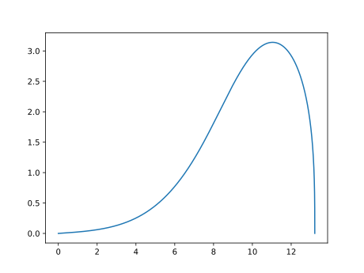

# Natural Shape Balloon 

This code implements the change of shape of a balloon depending on the altitude (from 15000 to 25000 meters) and set of design parameters.   

### Overview
The basis of this method is the numerical solution of a system of differential equations. The Solve(params) function from `solve.py` solves a system of 6 differential equations describing the shape of a balloon depending on the height and parameters $\theta_0$ and $p_0$.

$\theta'(s) = {-2 \pi(r_p w_p \sin\theta + (p_{gas} - p_{air}) r) \over T}$ \
$T'(s) = 2 \pi r_p w_p \cos\theta$ \
$z'(s) = \cos\theta$ \
$r'(s) = \sin\theta$ \
$p_{gas}'(s) = - p_{gas} k_h \cos\theta$ \
$p_{air}'(s) = - p_{air} k_{h_{air}} \cos\theta$

where $k_h = {\mu_{gas} g \over R T_{gas}}$ and $k_{h_{air}} = {\mu_{air} g \over R T_{atm}}$

The initial conditions are following:

$\theta_0$ \
$T_0 = {(L_0 + C_x \rho_{atm} v |v| \pi {r_{max} ^ 2 \over 2}) \over \cos\theta_0}$ \
$z_0 = 0$ \
$r_0 = 0$ \
$p_{gas} = P_{atm} + p_0$ \
$p_{air} = P_{atm}$ 

where $\theta_0$ and $p_0$ should be computed by current algorithm; $L_0$ is the payload weight (N), velocity and $r_{max}$ are fixed params, $P_{atm}$ is air pressure and $\rho_{atm}$ is air density.

More about this system of differential equations you can find in these papers:

[Baginski, F., Winker, J. The natural shape balloon and related models](https://doi.org/10.1016/j.asr.2003.10.030) \
[Baginski, F., On the Design and Analysis of Inflated Membranes: Natural and Pumpkin Shaped Balloons](https://www.jstor.org/stable/4096199)  

To find the optimal parameters $\theta_0$ and $p_0$, we use as called Simple Search method (`simple_search.py`). We calculate the output mass of LTA gas for that system and compare with theoretical mass of LTA gas. If the difference is 0 (with fixed accuracy) we can approve that the desired solution is found. 

### File System
* `params.py`: the list of parameters
* `calculate_rp.py`: calculate rp(s) function - pumpkin shape balloon radius depends on s
* `density.py`: calculate atmosphere and gas density, air pressure and gas temperature depends on the current altitude
* `solve.py`: the whole process to calculate the shape of the balloon (system's solver)
* `simple_search.py`: calculate optimal $\theta_0$, $p_0$ and $r_{max}$ for fixed velocity
* `main.py`: whole process to determine the natural shape, velocity, and volume of the balloon minimizing the difference between computed and theoretical mass of LTA gas 
* `requirements.txt`: used versions of python libraries
* `plots`: visual outputs of experiments
* `results`: text and data outputs of experiments

### Simple Search Method

We set the range for $\theta_0$ and $p_0$ and go from minimal value to maximal with fixed step. In doing so, we get some values of $\theta$ and $r$ at the top of the balloon (called them $\theta_{last}$ and $r_{last}$ respectively). Based on these values we decide in which direction we should move. As soon as the $\theta_{last}$ value crosses the threshold (-90 degrees), we take the previous and current $\theta_0$ values and now go along this segment with the smaller step. The same for $p_0$ and $r_{last}$ (threshold = 0 meters). Each of these processes is performed in 2 separate loops, in each of which the solver with a fixed maximal radius ($r_{max}$) and velocity is called. Continue these processes until we reach the desired accuracy. 

After that, we synchronize maximal radius of the balloon on the current altitude, call the solver again with finded $\theta_0$ and $p_0$. The difference between input and output $r_{max}$ should be 0. 

We continue whole this process until $\theta_{last}$ and $r_{last}$ after $r_{max}$ sync will be -90 and 0 (+- given tolerance) respectively.     

### Run the code
To launch the code you need to run the following: 
`python main.py --height [HEIGHT]`

### Output
At the output we get the txt file with complete information about the state of the balloon at the given altitude, csv file with lists of z and r (for future calculations) and svg file with a plot of z vs r. 

The following information is written to the text file:
* Parameters $\theta_0$ and $p_0$ that define the shape of the balloon
* Last values of $\theta$ (should be ~-90 degrees with given tolerance), r (~0 meters with given tolerance) 
* Maximal radius of the balloon on this altitude
* Volume of the balloon
* Difference between input and output mass of the LTA gas (should be ~0 kg with given tolerance)
* Differences between all forces (should be ~0)
* Input and output values of velocities and difference between them (should be ~0 m/s)

### Example

`python main.py --height 15000`

* Output result with following tolerances: for $m_{gas}$ - 0.00001, for $\theta_{last}$ - 0.001, for $r_{last}$ - 0.001:

  _______________________height =  15000 _______________________ \
  theta0:  1.2193599999999996 , p0:  -14.070000000000002 \
  Maximum radius:  3.141763547349405 \
  Last theta:  -89.99932706371716 , Last R:  0.0009499022133381274 \
  ___________________________________________________________________ \
  Volume of the balloon:  130.02809101854612 \
  Difference between m_gas and calculated m_gas:  -4.6893540042169946e-06 \
  Difference betweend Fa and Fg:  11.941509621322496 \
  Difference between all forces {(Fa - Fg) + F_drag}:  -1.7763568394002505e-15 \
  Input velocity of the balloon:  2.902734375 \
  Output velocity of the balloon:  2.90095174903956 \
  Difference between input and output velocities:  0.0017826259604398764 \
  Running time:  367.29792070388794 s 

* Data of zs and rs for future calculations: 
(the top part of table)

  z, r \
  0.0, 0.0 \
  0.0009997735499952865, 2.1280242710555148e-05 \
  0.0019995470996851034, 4.25604997725486e-05 \
  0.002999320648764043, 6.38407855342987e-05 \
  0.00399909419692677, 8.512111434072787e-05 \
  0.004998867743868021, 0.00010640150053337178 \
  0.0059986412892825995, 0.00012768195845038794 \
  0.006998414832865382, 0.0001489625024265649 \
  0.007998188374311307, 0.00017024314679333057 \
  0.008997961913315387, 0.00019152390587876152

* Plot of z vs r:

